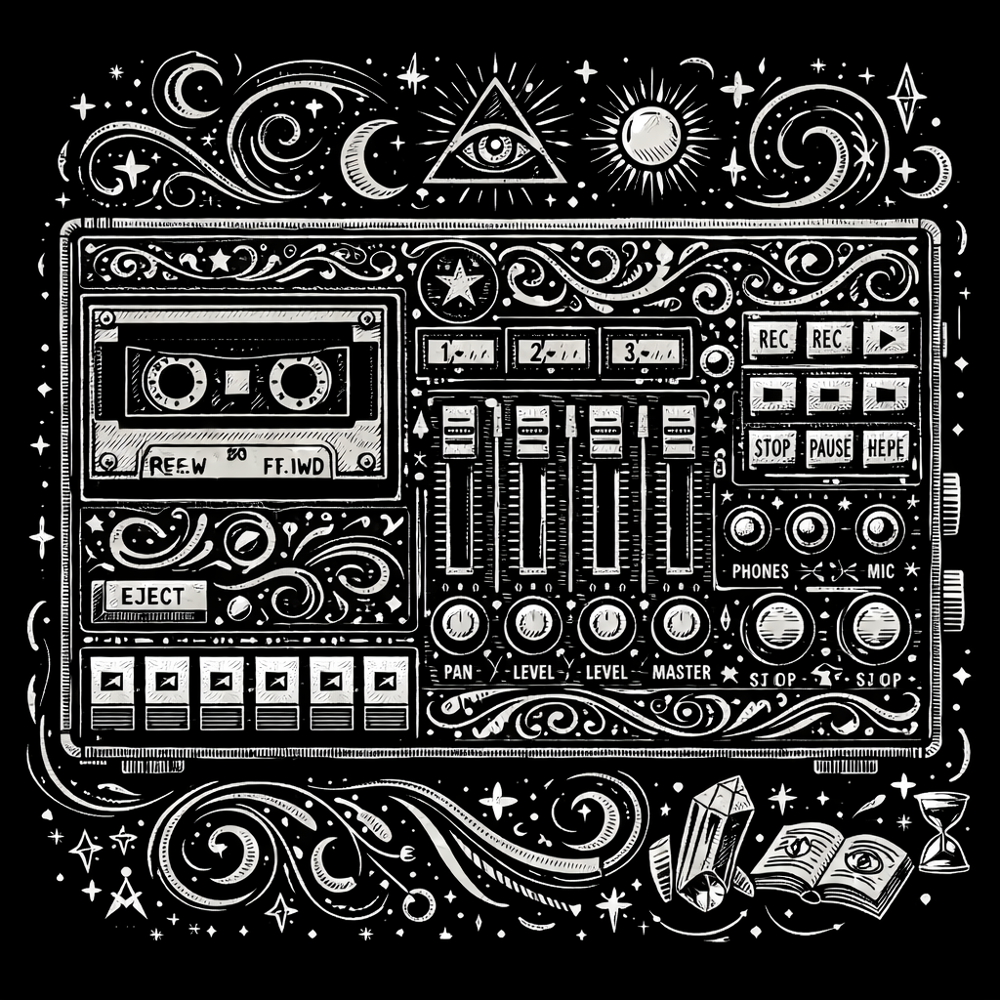

# Animate



**The animation control panel for Signals & Sorcery** — a menu of musical
automations applied to any tracks in the scene, rendered by deterministic
engine DSP so live playback and bounces sound identical.

Unlike the generator panels, Animate owns **no tracks**. It is a control
plane: pick an animation type, choose target tracks, set rate/depth/shape,
and the host compiles the spec to declarative engine configs (track motion
filter, track ducker, volume automation curves).

## Animation menu (slice 1)

| Family | Types |
|---|---|
| **Cyclic** | Pumper (grid-synced volume pump — no kick required), Autopan, Tremolo, Trance Gate |
| **Phrase** | Fade In, Fade Out, DJ Filter (HP/LP sweep across the loop), Riser |
| **Reactive** | Duck — targets dip when the "listen" source tracks hit (generalized sidechain; MIDI-onset or ghost-grid derived) |
| **Lab** | Stutter Gate, Drunk Walk (deterministic random filter wander), Breathing Mix (phase-spread slow undulation) |

The wire vocabulary (`AnimationType`) is a superset — reverb tail, delay
throw, washout, sidechain-filter, keyed gate, and gap-filler land in later
slices; audio-derived listening (`audio-onsets` / `audio-envelope`) rides
the deterministic render→analyze path when it ships.

## How it stays predictable

- **Declarative configs, never parameter streams** — one push per gesture;
  the engine renders per-sample in quarter-note time (live == render).
- **Self-healing** — onsets, loop span, and meter re-derive on every push;
  regenerated MIDI, bar edits, and scene clones stay correct.
- **Slot exclusivity** — one animation per (track, mechanism); conflicts are
  refused naming the claiming animation, never silently overwritten.
- **Capability-gated** — cross-track writes go through the host's
  `crossTrackAutomation` surface (`setAnimation`/`removeAnimation`), the
  single sanctioned exception to the plugin ownership model.

## Agent twins

`dsl_animate_list` / `dsl_animate_add` / `dsl_animate_update` /
`dsl_animate_remove` — same host methods, same validation, full chat/CLI
parity. Panel-bus wobble/duck stays on `dsl_bus_motion` / `dsl_bus_sidechain`.

## Development

```bash
npm install
npm test        # jest (ts-jest + jsdom + testing-library)
npm run build   # tsup → dist/ (the host consumes dist/)
```

Requires SDK >= 2.64.0 (`@signalsandsorcery/plugin-sdk`).
